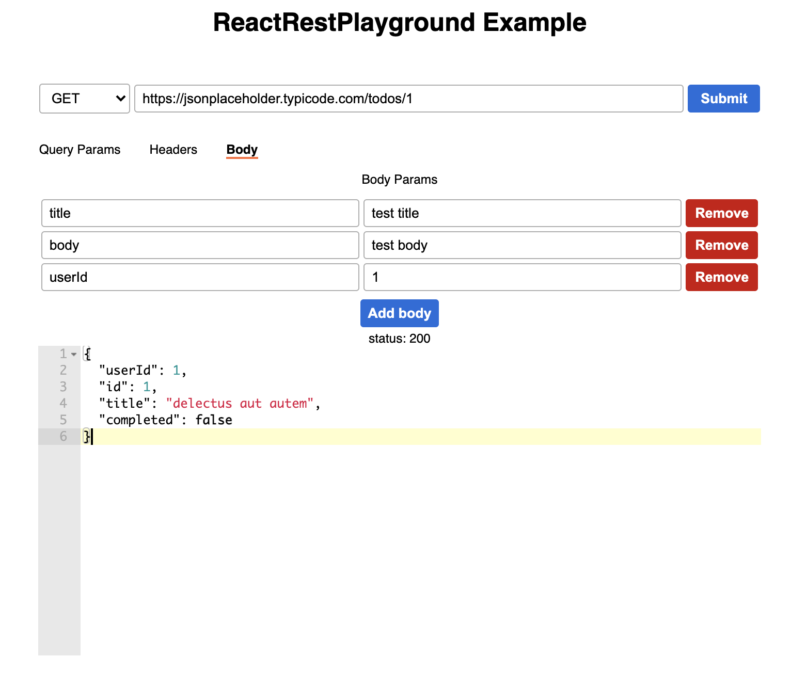

# react-rest-playground
Below is the example screenshot once component `<ReactRestPlayground />` rendered.




## Implementation

```
<ReactRestPlayground
  method={methodType}
  endPoint={apiUrl}
  headers={headerDetails}
  query={queryParamDetails}
  body={bodyDetails}
  onSend={() => {}}
/>
```

## Demo
1. In React Project - https://codesandbox.io/s/react-rest-playground-example-in-react-js-project-d18zu
1. In React Typescript Project - https://codesandbox.io/s/react-rest-playground-example-in-react-tsx-nftcl
